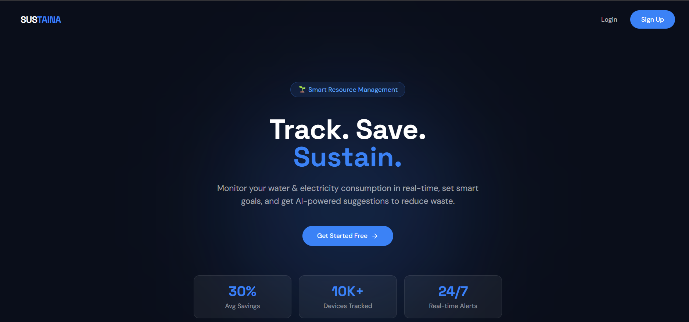
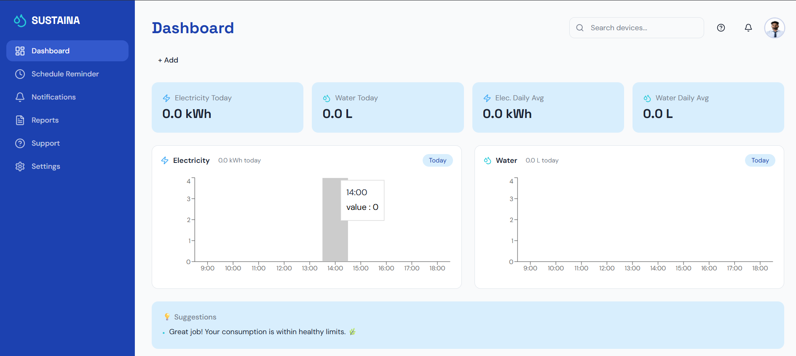
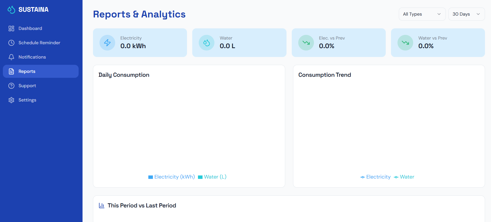

## Sustaina – Water & Electricity Management System
- A full-stack web application to track and manage water and electricity consumption with a modern dashboard and secure authentication.

## ✨ Features
- 🔐 User Authentication (Signup/Login with Email Verification)
- 📊 Interactive Dashboard with usage tracking
- 🧑‍💼 User Profile Management
- 🖼️ Avatar Upload (Supabase Storage)
- 🔒 Row Level Security (RLS)
- ⚡ Real-time data handling with Supabase
- 📱 Fully Responsive UI

## 🛠️ Tech Stack
- Frontend: React + Tailwind CSS
- Backend: Supabase
- Database: PostgreSQL
- Authentication: Supabase Auth
- Storage: Supabase Storage
- Version Control: GitHub


## Installation

The only requirement is having Node.js & npm installed - [install with nvm](https://github.com/nvm-sh/nvm#installing-and-updating)

Follow these steps:

```sh
# Step 1: Clone the repository using the project's Git URL.
git clone <YOUR_GIT_URL>

# Step 2: Navigate to the project directory.
cd <YOUR_PROJECT_NAME>

# Step 3: Install the necessary dependencies.
npm i

# Step 4: Start the development server with auto-reloading and an instant preview.
npm run dev
```


## Detail of Project

- Designed a responsive dashboard with real-time data visualization for monthly consumption and targets.

-  analytics-based recommendations to optimize     energy and water usage.

-  collect and process user consumption data.

- data aggregation and user insights generation.


## 📸 Screenshots

### 🔐 Onboarding Page


### 📊 Dashboard


### 📈 Report
